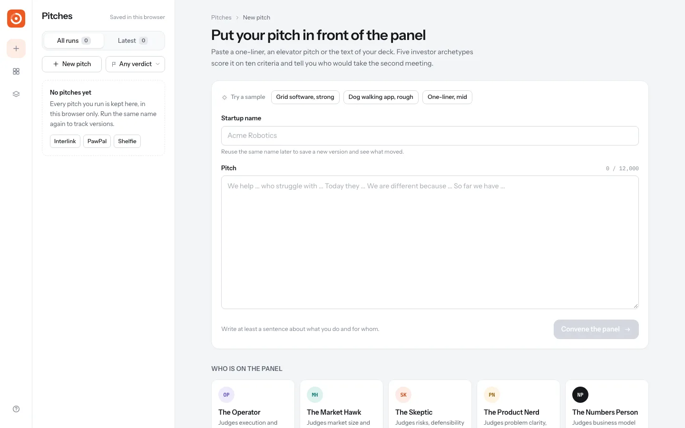
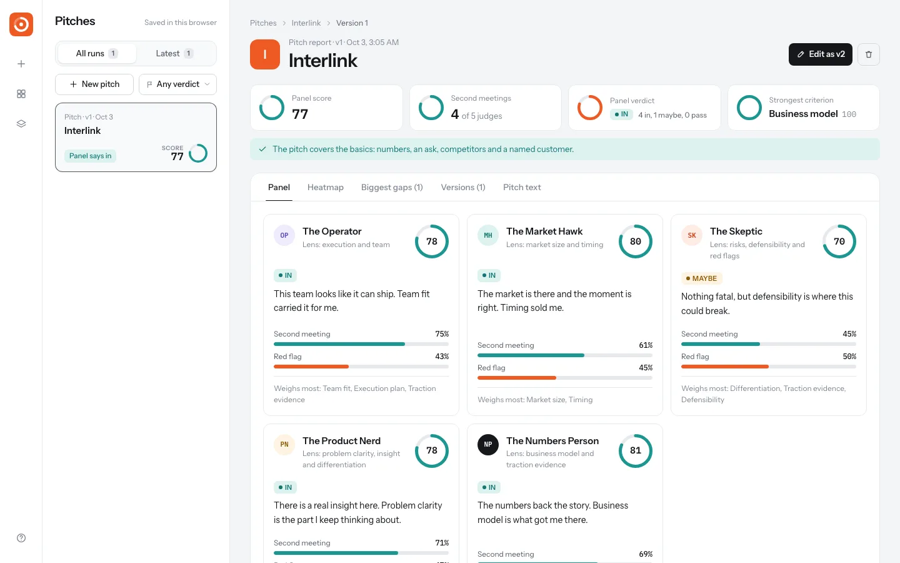
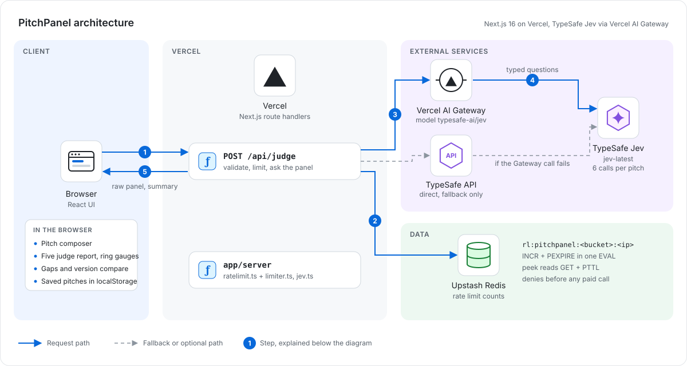

# PitchPanel

Put your startup pitch in front of five investor archetypes before the real meeting.

**Live demo:** https://pitchpanel.vercel.app


## How it works

Paste a startup pitch and a panel of five investor archetypes scores it: The Operator, The Market Hawk, The Skeptic, The Product Nerd and The Numbers Person. Each judge is a set of typed questions sent to TypeSafe's Jev with that judge's lens in the state. Every judge rates ten criteria on a four step ladder (score questions) and answers two booleans: would they take a second meeting, and is there a red flag. A sixth call checks the basics, like whether the pitch has numbers or a stated ask. Jev only returns numbers. The app turns them into judge scores, in / maybe / pass verdicts, a criteria by judge heatmap and templated advice for the weakest criteria. Past pitches stay in your browser, and running the same name again saves a new version you can compare.

## Screenshots





A longer recording is in [docs/demo.mp4](docs/demo.mp4).

## Architecture



1. The browser posts the pitch to `POST /api/judge`.
2. The route validates the length, then takes a rate limit slot in Upstash Redis and answers 429 when the window is used up.
3. It asks five judge calls and one checks call in parallel through Vercel AI Gateway (`typesafe-ai/jev`).
4. Jev answers each judge's ten score questions and two yes/no questions. If the Gateway fails, the same questions go straight to the TypeSafe API (dashed path).
5. The route summarizes the panel in `app/lib/panel.ts`, and the browser draws the report and keeps past versions in localStorage.

**Why it is built this way.** The TypeSafe and Gateway keys stay on the server. Jev only returns numbers, and verdicts and gaps are computed in code from them. The limit is counted in Redis before any paid call, so it holds across Vercel instances.

## Stack

Next.js 16 (App Router), React 19, Tailwind CSS v4, TypeScript and the Vercel AI SDK, deployed on Vercel. Jev calls go through Vercel AI Gateway and fall back to the TypeSafe API. Unit tests use the Node test runner.

## Run it

```bash
npm install
cp .env.example .env.local   # then fill in the keys
npm run dev                  # http://localhost:3000
npm test                     # scoring unit tests
```

## Config

| Variable | Purpose | Default |
| --- | --- | --- |
| `AI_GATEWAY_API_KEY` | Vercel AI Gateway key, tried first | none |
| `TYPESAFE_API_KEY` | Direct TypeSafe API key, used as fallback | none |
| `RATE_LIMIT_ANALYZE` | Panels per IP per window | `5` |
| `RATE_LIMIT_WINDOW_MS` | Rate limit window | `3600000` |
| `KV_REST_API_URL`, `KV_REST_API_TOKEN` | Upstash Redis that holds the rate limit counts | none |

The API is `POST /api/judge` with `{ "pitch": "..." }`. Pitches must be 20 to 12,000 characters.

Rate limit counts are global across instances because they live in Upstash Redis, keyed per app and per IP, with IPv6 grouped by /64. The window starts at your first counted request. Without the Redis variables (local dev, tests) counts fall back to memory, and if Redis is set but unreachable the API answers 503 rather than letting requests through.

## Related

Built alongside [ToneRadar](https://toneradar.vercel.app), [Headline Arena](https://headline-arena-gamma.vercel.app), [FinePrint](https://fineprint-beta.vercel.app) and [fallacy finder](https://fallacy-finder-nine.vercel.app), all on TypeSafe Jev. The first one was [JobFit](https://github.com/Sahilll15/jobfit).
